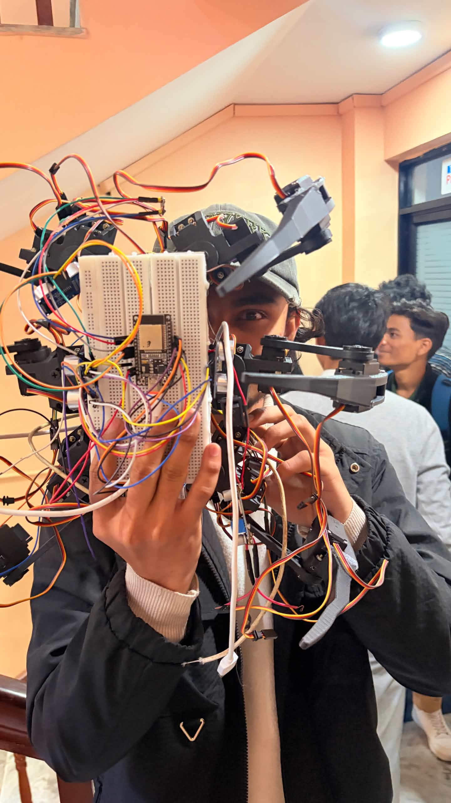

# 🕷️ Spyder: IoT-Powered Hexapod Surveillance Robot

### 6-Legged Hexapod Surveillance Robot

An ESP32-powered IoT surveillance robot featuring multi-servo locomotion, live video streaming, and mobile app remote control.

 

---

# 📖 About

Spyder is a six-legged surveillance robot designed for remote monitoring and IoT experimentation.

The project combines robotics, embedded systems, IoT, mechanical design, and mobile control into a single autonomous platform capable of walking, streaming live video, and remotely navigating its surroundings.

The robot was independently designed and developed from concept through implementation, including mechanical assembly, electronic integration, firmware development, and testing.

---

# ✨ Features

- Six-legged hexapod locomotion
- ESP32-based control system
- ESP32-CAM live video streaming
- 180° rotating camera
- Mobile app remote control
- Multi-servo walking mechanism
- PCA9685 servo driver
- Real-time surveillance

---

# 🔧 Hardware Used

- ESP32
- ESP32-CAM
- PCA9685 Servo Driver
- MG996R Servo Motors
- Micro Servo
- 18650 Battery Pack
- Custom Acrylic Chassis

---

# 🛠 Software

- Arduino IDE
- C++
- ESP32 Libraries

---

# 📸 Build Process

## 🔧 Initial Assembly

The initial chassis was assembled by mounting the servo brackets and preparing the frame for leg installation.

---

## ⚙️ Mechanical Integration

The six legs were assembled and connected using MG996R servo motors, forming the robot's complete walking mechanism.

---

## 🔌 Electronics Assembly

The ESP32, PCA9685 servo driver, batteries, wiring, and power distribution were integrated into the robot.

---

# 📷 180° ESP32-CAM

The ESP32-CAM is mounted on a rotating mechanism, allowing approximately **180° horizontal movement** for improved surveillance coverage and live video streaming.

---

# 🤖 Final Prototype

The completed 6-legged surveillance robot featuring:

- 🕷️ 6-Legged Hexapod Design
- 🎥 ESP32-CAM Live Streaming
- 🔄 180° Camera Rotation
- 📡 Mobile App Remote Control
- ⚙️ PCA9685 Servo Controller
- 🚶 Multi-joint Walking Mechanism

---

# 🎥 Testing Demonstration

A demonstration of the robot's movement and camera system can be viewed here:

➡️ **[Watch Testing Video](testing.html)**

---

# 📚 Engineering Challenges

Some of the challenges encountered during development included:

- Coordinating multiple servo motors simultaneously.
- Managing power distribution across the servo network.
- Designing a stable six-legged walking mechanism.
- Integrating live video streaming with robotic movement.
- Optimizing mechanical balance and weight distribution.

---

# 📖 What I Learned

- Embedded Systems
- ESP32 Programming
- Robotics
- Servo Control
- IoT System Design
- Mechanical Assembly
- Hardware Troubleshooting
- Power Management
- Sensor Integration
- Prototype Development

---

# ⚠ Repository Note

This repository documents the project development, hardware, and testing process.

Unfortunately, the complete Arduino source code is **not included**. During development, the firmware was created using Arduino IDE and was not pushed to GitHub before the development laptop experienced a hardware failure, resulting in the loss of the original source files.

The remaining project assets—including build images, final prototype, and testing media—have been preserved to document the design and implementation of the project.

---

# 👨‍💻 Author

## Dibyant Bhatta

# 🤝 Acknowledgements

This project was developed collaboratively as part of an academic team project.

I would like to thank my teammates for their contributions, collaboration, and support throughout the design and development process.

---

### ⭐ If you found this project interesting, consider giving it a star!

